# depgraph-maven-plugin
*- A Maven plugin that generates dependency graphs in various formats (DOT, GML, PlantUML, JSON and Text)*

[](https://github.com/ferstl/depgraph-maven-plugin/actions/workflows/maven.yml)  [](https://maven-badges.herokuapp.com/maven-central/com.github.ferstl/depgraph-maven-plugin) [](https://coveralls.io/github/ferstl/depgraph-maven-plugin?branch=master) [](https://opensource.org/licenses/Apache-2.0)

This Maven plugin generates dependency graphs on single modules or in an aggregated form on multi-module projects. The dependency graphs can be created in the following formats:
- `.dot`<br/>
  DOT files can be visualized with [Graphviz](http://www.graphviz.org/). When [Graphviz](http://www.graphviz.org/) is installed, the generated `.dot` files can be directly rendered into all supported image formats. 
- `.gml` (Graph Markup Language)<br/>
  GML files can be visualized with the [yEd Graph Editor](https://www.yworks.com/products/yed) which allows further processing and layouting of the dependency graph.
- `.mmd` (Mermaid)<br/>
  Mermaid graphes can be easily embedded in application and in markdown files. See [here](https://mermaid-js.github.io/mermaid/#/).
- `.puml` (PlantUML)<br/>
  PlantUML files can be visualized by various tools like [planttext.com](https://www.planttext.com/) or in IntelliJ with the [PlantUML Plugin](https://plugins.jetbrains.com/plugin/7017-plantuml-integration).
- `.json`<br/>
  This format is intended for Javascript libraries to visualize the dependency graph or for further processing.
- `.txt`<br/>
  A more powerful alternative to `mvn dependency:tree`. The text graphs are printed to the console. 

For more information take a look at the [Plugin Documentation](https://ferstl.github.io/depgraph-maven-plugin/plugin-info.html), the [Release Notes](https://github.com/ferstl/depgraph-maven-plugin/releases) and the [Wiki](https://github.com/ferstl/depgraph-maven-plugin/wiki).


## Getting Started
The *depgraph-maven-plugin* is available on [Maven Central](http://central.maven.org/maven2/com/github/ferstl/depgraph-maven-plugin/). So no further repository configuration is required.

Unless configured otherwise, the dependency graphs will be written to the project's build directory, `target/dependency-graph.<extension>`.

### Run in your Maven Project
To use the plugin within your project, just add it to the `<build>` section:

    <build>
      <plugins>
        <plugin>
          <groupId>com.github.ferstl</groupId>
          <artifactId>depgraph-maven-plugin</artifactId>
          <version>4.0.1</version>
          <configuration>
            ...
          </configuration>
        </plugin>
      </plugins>
    </build>


### Run on the Command Line
For ad-hoc dependency analysis the plugin can be used directly on the command line. To conveniently use this plugin on the command line, it is recommended to add the groupId `com.github.ferstl` as "plugin group" in your Maven `settings.xml`:

    <settings>
      ...
      <pluginGroups>
        <pluginGroup>com.github.ferstl</pluginGroup>
      </pluginGroups>
      ...
    </settings>

With this configuration, you can use the short form `depgraph:<goal>` on the command line, e.g.

    mvn depgraph:graph

Without defining the plugin group, you need to fully qualify the plugin on the command line, e.g.:

    # Latest version
    mvn com.github.ferstl:depgraph-maven-plugin:graph
    
    # Specific version
    mvn com.github.ferstl:depgraph-maven-plugin:4.0.1:graph

## Examples

All examples are based on a [multi-module project](https://github.com/ferstl/depgraph-maven-plugin/tree/master/src/test/projects/depgraph-maven-plugin-test) with the following structure:

    parent
    - module-1
    - module-2
    - sub-parent
      - module-3

Each of the modules contains some dependencies in different scopes.


### Simple Dependency Graph

A simple graph can be created by executing the [`depgraph:graph`](https://ferstl.github.io/depgraph-maven-plugin/graph-mojo.html) goal:

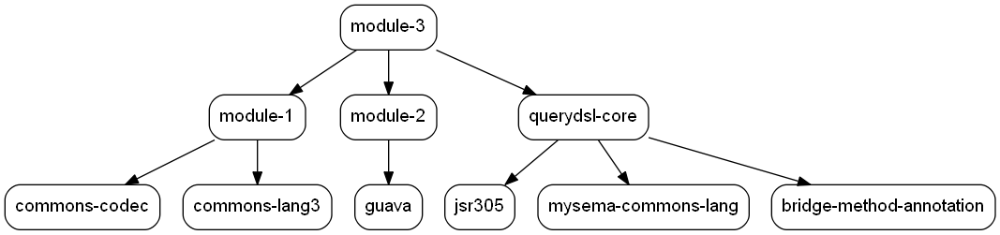

The goal can be configured to show the versions and/or groupIds on the dependencies:

**With versions (`-DshowVersions`)**

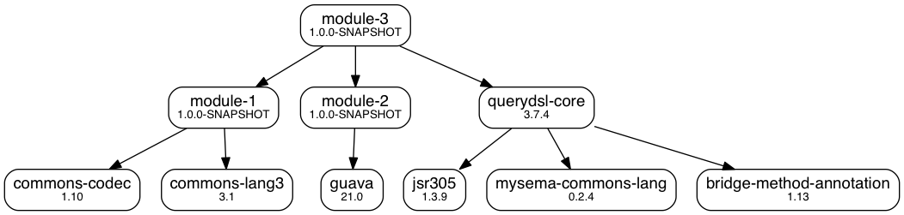


**With groupIds (`-DshowGroupIds`)**

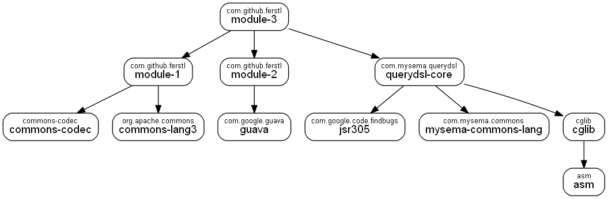

### Duplicates and Conflicts

The [`depgraph:graph`](https://ferstl.github.io/depgraph-maven-plugin/graph-mojo.html) goal can be configured to show duplicate (`-DshowDuplicates`) and/or conflicting (`-DshowConflicts`) versions. Duplicate versions are shown as dotted black arrows. Conflicting versions are shown as dashed red arrows:

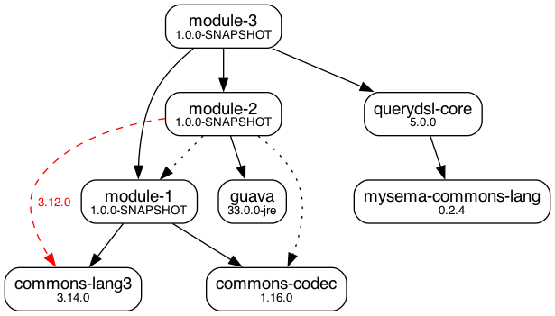

Duplicate dependencies do occur when more than one module defines the same dependency, which is not a problem: Maven's dependency resolution will just pick one dependency and omit all the duplicates. A conflict occurs when the same dependency occurs in different versions in the reactor. In this case Maven will choose the [nearest](http://maven.apache.org/guides/introduction/introduction-to-dependency-mechanism.html) version and ommit the others. Occurrences of conflicting versions should be investigated and solved if possible.  

### Dependency Graph by `groupId`

The [`depgraph:by-groupid`](https://ferstl.github.io/depgraph-maven-plugin/by-groupid-mojo.html) goal creates a dependency graph using the `groupId` of the dependencies:

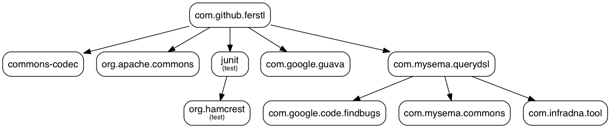

Such graphs give a higher-level overview of a project, i.e. they show better which "frameworks" used by a maven project.


### Aggregated Graphs

The goals [`depgraph:aggregate`](https://ferstl.github.io/depgraph-maven-plugin/aggregate-mojo.html) and [`depgraph:aggregate-by-groupid`](https://ferstl.github.io/depgraph-maven-plugin/aggregate-by-groupid-mojo.html) create aggregated dependency graphs on the root of a multi-module project. They show the **union** of all the modules' dependencies by omitting redundant edges. Here is an example of an aggregated graph, which connects the parent project and its modules with dotted black arrows (the `sub-parent` and its `module-3` were excluded from the graph for clarity):

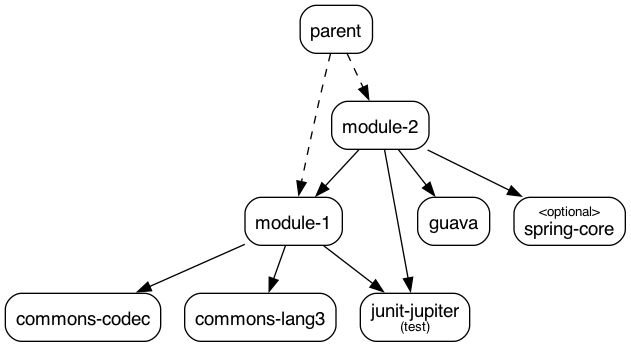


The goal [`depgraph:aggregate-by-groupid`](https://ferstl.github.io/depgraph-maven-plugin/aggregate-by-groupid-mojo.html) does the same for the group IDs of all modules and their dependencies.


### Graphs from Arbitrary Artifacts
The goal [`depgraph:for-artifact`](https://ferstl.github.io/depgraph-maven-plugin/for-artifact-mojo.html) creates a dependency graph for an arbitrary artifact. This goal can be executed without a Maven project at any place:

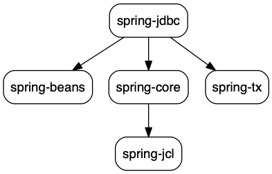


### Reactor graph

The goal [`depgraph:reactor`](https://ferstl.github.io/depgraph-maven-plugin/reactor-mojo.html) creates a dependency graph
for the build reactor of a multi-module project:

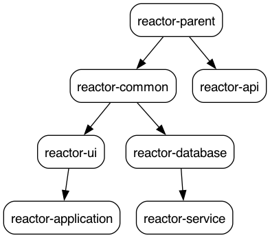


### Styling

This Maven plugin offers you a variety of styling options for graphs in the DOT format. These options are explained in detail on the [Styling Wiki page](https://github.com/ferstl/depgraph-maven-plugin/wiki/Styling). This is an example of the aggregated graph with some custom styles:

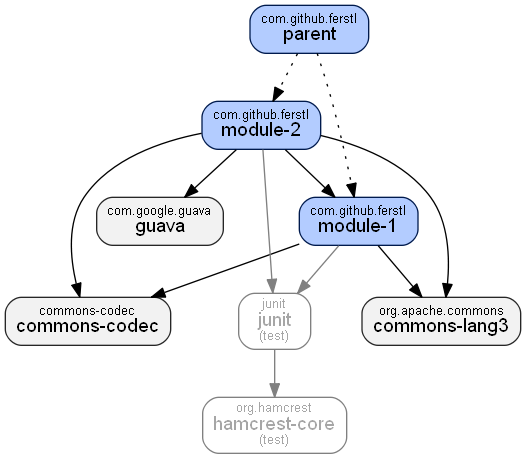

It shows all dependencies with group ID `com.github.ferstl` with a blue background, all test dependencies with grey text and all other dependencies with grey background.

### Other Graph Formats
#### GML for yEd

The GML graph format (set the `graphFormat` property to `gml`) allows visualizing a dependency graph in the [yEd Graph Editor](https://www.yworks.com/products/yed).

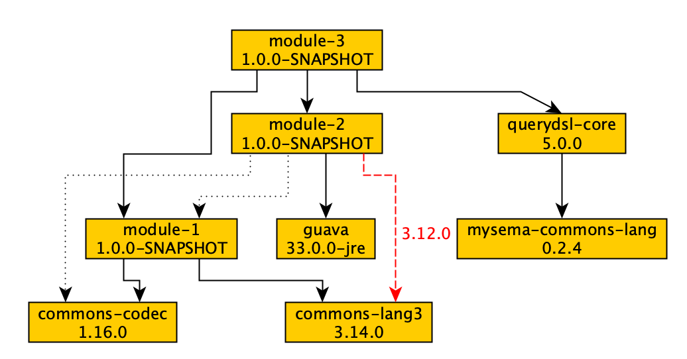

Since the generated dependency graph does not store any layout information, you need to layout the graph in yEd:

- Choose *Tools -> Fit Node To Label* and press *OK* in the upcoming dialog
- Choose your layout algorithm in the *Layout* menu to layout the graph


#### Mermaid

Mermaid graphes can be easily embedded in application and in markdown files. See [here](https://mermaid-js.github.io/mermaid/#/).

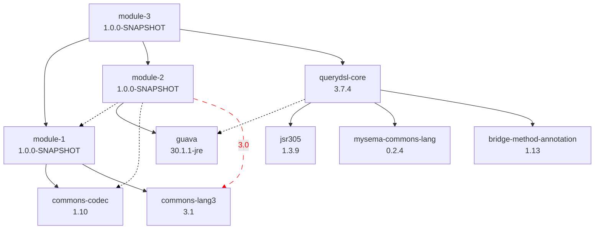

#### PlantUML

PlantUML graphs can be visualized with various tools, e.g. [planttext.com](https://www.planttext.com/) or the [PlantUML Integration](https://plugins.jetbrains.com/plugin/7017-plantuml-integration) for IntelliJ (requires [Graphviz](http://www.graphviz.org/) for rendering).

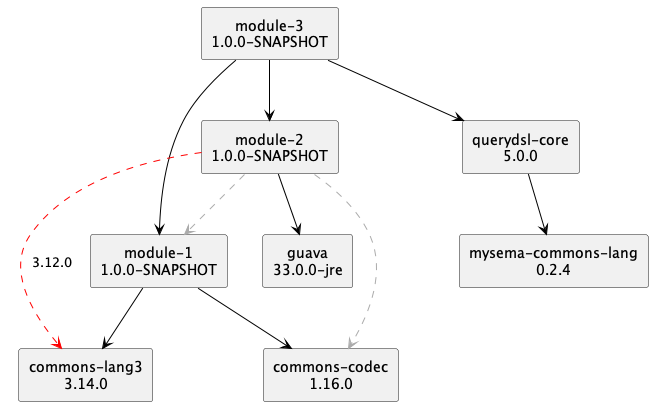


#### Text

Text graphs are a more powerful alternative for `mvn dependency:tree`. They are printed to the console for direct investigation.

```
parent:1.0.0-SNAPSHOT:compile
+- module-1:1.0.0-SNAPSHOT:compile
|  +- commons-codec:1.10:compile
|  \- commons-lang3:3.1:compile
+- module-2:1.0.0-SNAPSHOT:compile
|  +- module-1:1.0.0-SNAPSHOT:compile
|  +- guava:21.0:compile
|  \- spring-core:5.0.6.RELEASE:compile (optional)
\- sub-parent:1.0.0-SNAPSHOT:compile
   +- module-3:1.0.0-SNAPSHOT:compile
   |  +- module-2:1.0.0-SNAPSHOT:compile
   |  \- querydsl-core:3.7.4:compile
   |     +- jsr305:1.3.9:compile
   |     +- mysema-commons-lang:0.2.4:compile
   |     \- bridge-method-annotation:1.13:compile
   \- module-2:1.0.0-SNAPSHOT:compile

```

For the aggregated graphs, the option `-DrepeatTransitiveDependenciesInTextGraph` will show transitive dependencies on each node. Without this option (which is the default), transitive dependencies will only be shown the first time they occur.

#### JSON

JSON graphs are intended for Javascript libraries or for further processing. Using this format will automatically enable the options `showGroupIds`, `showVersions`, `showTypes` and `showClassifiers`. The idea behind enabling these options is that the consumer of the JSON data should do its own filtering. This behavior can be disabled by setting `showAllAttributesForJson` to `false`.

````json
{
  "graphName" : "parent",
  "artifacts" : [ {
    "id" : "com.github.ferstl:module-2:jar:compile",
    "numericId" : 1,
    "groupId" : "com.github.ferstl",
    "artifactId" : "module-2",
    "version" : "1.0.0-SNAPSHOT",
    "optional" : false,
    "scopes" : [ "compile" ],
    "types" : [ "jar" ]
  }, {
    "id" : "com.github.ferstl:module-1:jar:compile",
    "numericId" : 2,
    "groupId" : "com.github.ferstl",
    "artifactId" : "module-1",
    "version" : "1.0.0-SNAPSHOT",
    "optional" : false,
    "scopes" : [ "compile" ],
    "types" : [ "jar" ]
  } ],
  "dependencies" : [ {
    "from" : "com.github.ferstl:module-2:jar:compile",
    "to" : "com.github.ferstl:module-1:jar:compile",
    "numericFrom" : 0,
    "numericTo" : 1,
    "resolution" : "INCLUDED"
  } ]
}
````

## FAQ

Q: Help! The dependency graph of my 10 year old 100-module enterprise project looks like a ball of wool. I can't see anything!

A: Think carefully what information you want to see in your dependency graph. Do you really want to have all third-party dependencies in your graph or do you want to see only the dependencies between your own modules? Would the `groupId` graph be a better alternative?
Generally, you should consequently exclude dependencies that don't give you useful information. The inclusion/exclusion mechanisms in this plugin are quite powerful and easy to use. A good starting point is the exclusion of dependencies to "utility" libraries, such as `commons-lang`, `guava` or `my-enterprise-project-common`. Such dependencies are typically used by every single module which is (in most cases) perfectly fine. So they don't give you much useful information when they show up in the dependency graph.

-----

Q: Help! This plugin has thousands of parameters. How do I know which ones to choose?

A: Don't worry, there are only less than 40 parameters and the plugin provides good defaults for most of them. Start your dependency graph without setting any parameters and see if it fits your needs. If it doesn't, start customizing it:
- Use `graphFormat` to get a graph in a different format than DOT.
- Use `includes` and/or `excludes` for filtering.
- Use the `show*` parameters to display more information in the graph, e.g. `showGroupIds`, `showVersions`, etc.

That's basically it. If you get interested in further customizations or if you want to do a more detailed analysis of your dependencies, take a look at the other parameters.

-----

Q: Why can't I show duplicates and conflicts in the aggregated graph.

A: This does not make sense because dependencies are resolved individually for each module in the reactor. As a result, the same dependency edge in the graph could once occur as conflict, once as duplicate and once as resolved dependency.

Example:
Suppose, we have two modules `module-1` and `module-2` in the reactor. `module-2` has a dependency to `module-1` and both modules have a dependency to the third-party library `commons-wtf`. `module-1` references version `3.0` of this library and `module-2` references version `3.1`. If we now would display conflicts in the aggregated graph, we would get these edges (amongst others):

    module-1 --- 3.1 (included) ---> commons-wtf  (perspective of module-1)
    module-1 --- 3.1 (conflict) ---> commons-wtf  (perspective of module-2)
    module-2 --- 3.0 (included) ---> commons-wtf  (perspective of module-2)

Such a graph is not useful whatsoever. Unless it is not possible to access all resolved dependencies within the whole reactor, we cannot show duplicates and conflicts.

-----

Q: How do the `includes`/`excludes` and the other filtering parameters work?

A: The filtering parameters are a comma-separated list in the form of `groupId:artifactId:type:classifier`. Not all parts need to be specified and there is wildcard support.
Examples:

- All spring-web\* dependencies: `org.springframework:spring-web*`
- A test jar: `com.mycompany:mylib:jar:tests`
- The same test jar, but without explicit `type` part `com.mycompany:mylib::tests`

A dependency will show up in the graph when it matches the `includes` list **and** doesn't match the `excludes` list.

Take also a look at the [Filtering](https://github.com/ferstl/depgraph-maven-plugin/wiki/Filtering) documentation in the Wiki.
